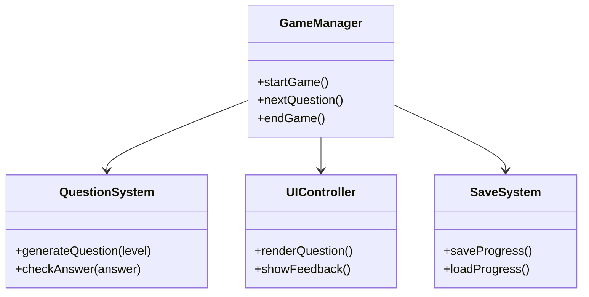

# Sơ Đồ Lớp

```mermaid
classDiagram
    class GameManager {
        +startGame()
        +nextQuestion()
        +endGame()
    }
    class QuestionSystem {
        +generateQuestion(level)
        +checkAnswer(answer)
    }
    class UIController {
        +renderQuestion()
        +showFeedback()
    }
    class SaveSystem {
        +saveProgress()
        +loadProgress()
    }
    GameManager --> QuestionSystem
    GameManager --> UIController
    GameManager --> SaveSystem
```